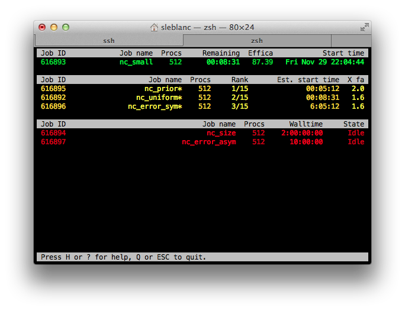
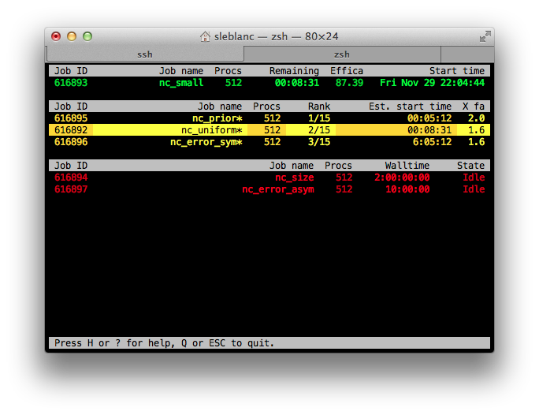
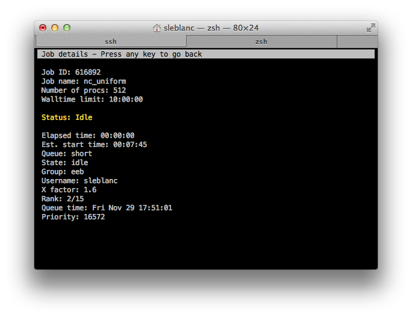

# PBSC

PBSC fetches information about jobs in your PBS queue and display the result in a nice and colorful curses window.
It uses the commands `showq` and `checkjob` to get information about your current queued jobs.

This was created to scratch an itch and tailored to specific needs.
Fell free to contribute to make it more generic.

# Prerequisites

- ruby (tested on 1.8.7 and 2.0)
- `showq`
- `checkjob`

## Usage

To see your jobs run:

	$ pbsc

then type

- `H` for help
- `Q`/`ESC` to exit
- `Up`/`Down` to highlight specific jobs
- `Enter`/`Space`/`Right` to show details about the highlighted job
- `R` to refresh the list

That's about it!

## Screenshots

## License

The source for PBSC is released under the GNU General Public License as
published by the Free Software Foundation, either version 3 of the License,
or (at your option) any later version.
